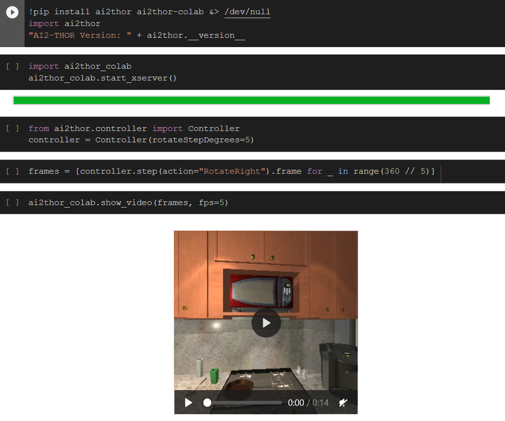

<p align="center"></p>

---

AI2-THOR Colab provides support for running [AI2-THOR](https://github.com/allenai/ai2thor) freely on the cloud using Google Colab. AI2-THOR is a near photo-realistic interactable framework for AI agents.

## Templates

To get started, we recommend saving a copy of the <a href="https://colab.research.google.com/drive/1VyvpUahrlakrlwebuuFZl73ioqCuVF33?usp=sharing" target="_blank">AI2-THOR Colab Minimal Starter Template</a> to your drive.

<a href="https://colab.research.google.com/drive/1VyvpUahrlakrlwebuuFZl73ioqCuVF33?usp=sharing" target="_blank">
  
</a>

## AI2-THOR Colab API Summary

Using Python's packaging manager, `ai2thor_colab` can be installed with

```python
pip install ai2thor_colab
```

#### Start X Server

AI2-THOR requires an X Server to run on a Linux machine. It allows us to open a Unity window where we can render scenes and observe images. Colab runs Linux, but it does not start an X Server by default. Using `ai2thor_colab.start_xserver()`, we can install all required xserver dependencies and start it up:

```python
import ai2thor_colab
ai2thor_colab.start_xserver()
```

#### Show Video

Given a sequence of image frames, we can merge them into a video and play it inside of Colab. For instance, we may `RotateRight` 10 times, and observe the frames after each action:

```python
from a2thor.controller import Controller
controller = Controller()

frames = [controller.step("RotateRight").frame for _ in range(10)]
ai2thor_colab.show_video(frames, fps=5)
```

## License

AI2-THOR Colab is licensed under [Apache 2.0](LICENSE).
